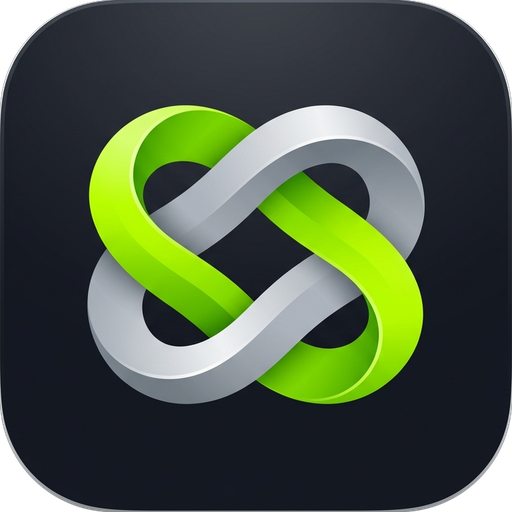

<div align="center">



# 腺动（Kegel Trainer）

**面向男性的科学盆底肌训练 Android 应用**  
*专注核心力量 · 节奏律动引导 · 极致隐私保护 · 纯本地运行*

[-brightgreen.svg?style=flat-square&logo=android)](https://developer.android.com)
[](https://kotlinlang.org)
[](https://developer.android.com/jetpack/compose)
[](https://github.com/qydxyx/kegel-trainer/releases)
[](https://github.com/qydxyx/kegel-trainer/actions)
[](LICENSE)

</div>

---

## 📖 项目简介

**腺动（Kegel Trainer）** 是一款专为男性设计的盆底肌（PC肌）科学训练与健康管理应用。

旨在帮助男性用户改善盆底肌群张力、增强核心控制力与前列腺机能健康。应用构建了对标专业级健康训练软件的核心闭环：从**入职能力测评**、**个性化 28 天进阶计划**、**多维课程库**、**沉浸式语音/震动播放器**，到**可视化履历与成就勋章**。

我们坚守**隐私第一**原则：应用**无需注册账号**、**无云端数据回传**，所有健康与训练数据均 100% 加密保存在手机本地。

---

## ✨ 核心特性

### 🎯 1. 科学进阶 28 天训练计划
- **基准测评与问卷**：综合年龄、运动基础、改善目标（控尿能力、运动表现、腺体保健）与每日可用时长，量身定制计划。
- **PC 肌感知定位指引**：详细图文与感知动作教学，助您准确找到盆底肌群，避免腹部或臀部错误代偿。
- **渐进式负荷周期**：由浅入深划分为「神经唤醒」、「基础耐力」、「肌力强化」与「高阶控制」四大周期，循序渐进。

### ⚡ 2. 交互式精准训练播放器
- **高精度防漂移时钟**：底层基于 Android `SystemClock.elapsedRealtime()` 计算时间步进，杜绝前后台切换、系统节电或掉帧导致的训练节奏漂移。
- **动态视觉律动环**：收缩（Squeeze）、保持（Hold）、舒张（Relax）三阶段动态张力动画，呼吸节奏一目了然。
- **实时语音节拍指导**：内置 TTS 语音播报，清晰提示当前阶段、倒计时与收发力技巧。
- **多级线性触觉反馈**：专为线性马达优化的振动模式，即便闭眼或不看屏幕也能精准把握节奏。
- **隐蔽模式（Covert Mode）**：极简低调界面，在办公室、通勤等公共场景也能安心无痕训练。

### 📚 3. 丰富实用的多元课程库
- **闪电快缩训练**：锻炼快速收缩爆发力与神经反应。
- **深层阶梯保持**：强化慢肌纤维耐力与深层支撑力。
- **复合节奏强化**：快慢结合，模拟日常多场景下的肌肉动态控制。
- **自由随时加练**：打破主线计划限制，随时随地开启单项针对性练习。

### 📊 4. 数据履历与成就体系
- **训练热力月历**：直观展示每月打卡记录、连续完成天数（Streak）与总训练时长。
- **多维成就勋章**：解锁「初窥门径」、「坚持不懈」、「钢铁核心」等里程碑成就，让每一次自律都看得见。

### 🔒 5. 极致隐私与安全
- **零账号 · 零上报**：不收集任何个人身份信息，无需网络连接即可使用完整功能。
- **本地持久化**：所有历史记录与设置均存储在本机 Room SQLite 与 DataStore。

---

## 📱 界面与设计语言

应用遵循 **Material Design 3 (Material You)** 设计规范，支持深色模式与动态配色。

* **全新张力环图标（Tension Loop）**：以肌肉纤维收缩与舒张的交互张力为核心隐喻，采用钛金哑光底色配合电光青柠绿（Hyper-Lime），展现极简现代的科技运动质感。
* **自适应与动态取色**：支持 Android 13+ Themed Icons 单色图标适配，与系统主题浑然一体。

---

## 🛠️ 技术栈与架构

本项目采用现代化 Android 开发技术栈与单向数据流（UDF）架构设计：

```
app/
├── data/          # 数据层：Room Database、DataStore 本地持久化与仓储实现
├── domain/        # 领域层：训练计划引擎、播放器状态机、成就计算器与用例模型
├── ui/            # UI 层：Jetpack Compose 声明式界面、ViewModel、Material 3 主题
├── voice/         # 语音引擎：Android TTS 语音合成与调度
├── haptic/        # 触觉引擎：Vibrator / VibrationEffect 震动模式调度
└── notify/        # 通知服务：精确闹钟（Exact Alarm）与提醒广播接收器
```

* **开发语言**：Kotlin 2.0+（Coroutines & Flow 响应式流）
* **UI 框架**：Jetpack Compose + Compose Navigation + Material 3
* **依赖注入**：Dagger Hilt
* **本地存储**：Room Database (SQLite) + Jetpack DataStore Preferences
* **架构模式**：MVVM / MVI + Clean Architecture
* **工程构建**：Gradle Kotlin DSL (`build.gradle.kts`) + Version Catalogs (`libs.versions.toml`)

---

## 🚀 快速开始与本地构建

### 环境要求
- **JDK**：OpenJDK 17 或 Oracle JDK 17
- **Android SDK**：`compileSdk = 35`, `minSdk = 26` (Android 8.0+)
- **IDE**：Android Studio Ladybug (2024.2+) 或更高版本

### 构建步骤

1. **克隆仓库**：
   ```bash
   git clone https://github.com/qydxyx/kegel-trainer.git
   cd kegel-trainer
   ```

2. **配置 SDK 路径**：
   ```bash
   cp local.properties.example local.properties
   # 编辑 local.properties，确认 sdk.dir 指向本地 Android SDK 路径
   ```

3. **设置 Java 环境并编译**：
   ```bash
   export JAVA_HOME="$(/usr/libexec/java_home 2>/dev/null || echo /opt/homebrew/opt/openjdk@17/libexec/openjdk.jdk/Contents/Home)"

   # 编译 Debug APK
   ./gradlew :app:assembleDebug

   # 执行单元测试
   ./gradlew :app:testDebugUnitTest

   # 直接安装至已连接的调试设备
   ./gradlew :app:installDebug
   ```

---

## 📦 下载与版本发布

### 下载 APK
请前往 GitHub 仓库的 [Releases 页面](https://github.com/qydxyx/kegel-trainer/releases) 下载最新版本的 `kegel-trainer-v*.apk` 文件。下载完成后在 Android 系统的「安全与隐私」中允许安装未知来源应用即可。

### 自动化发布流程 (CI/CD)
本项目已配置 GitHub Actions 自动化工作流。发布新版本时：
1. 更新 `app/build.gradle.kts` 中的 `versionCode` 和 `versionName`；
2. 提交并打上 Git Tag 后推送：
   ```bash
   git tag v1.1.0
   git push origin v1.1.0
   ```
3. GitHub Actions 将自动构建已签名的 Release APK 并自动生成 Release 发布日志。

---

## ⚠️ 免责声明

1. **非医疗器械**：本应用仅供个人日常健康训练与运动打卡参考，并非医疗器械或诊断工具。
2. **专业医疗建议**：本应用不提供任何形式的医疗诊断或治疗方案。若您近期接受过前列腺/盆腔手术，或存在剧烈盆底疼痛、严重尿失禁等病理症状，请在训练前咨询泌尿外科或盆底康复专科医师。

---

## 📄 开源许可

本项目基于 [MIT License](LICENSE) 协议开源。
